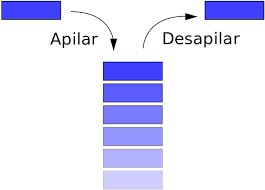

# APUNTES DE LA CLASE DE ALGORITMIA Y ESTRUCTURA DE DATOS AVANZADA
## docente en clase: Carlos Gavidia

En el siguiente repositorio, se encuentran todos mis apuntes de la clase, tanto
la parte teórica como ejercicios prácticos.

## SEMANA 1: INTRODUCCIÓN A LA PROGRAMACIÓN ORIENTADA A OBJETOS
Introducción a POO, toda clase necesita un constructor, para definirla introducimos dentro de la clase 
"def __init__(self)" y dentro todos los atributos que tendrá nuestra clase.

Después se encuentran los métodos, los cuales son funciones dentro de las clases, pero ahora se le llaman métodos.

Creación de la clase Fraccion, con los atributos numerador y denominador, y los metodos [representar, sumar, restar, convertir_a_float, invertir]

## SEMANA 2: PILAS Y COLAS
Implementación de la estructura de datos PILAS y COLAS.

En la estuctura de datos Pilas, los elementos se van ingresando en la lista, al momento de retirar un elemento, se retira el ultimo apilado.

En la estructura de datos Colas, los elementos se van ingresando en la lista, al momento de retirar un elemento, se retira el primer elemento de la cola.

## SEMANA 4: LISTAS ENLAZADAS
